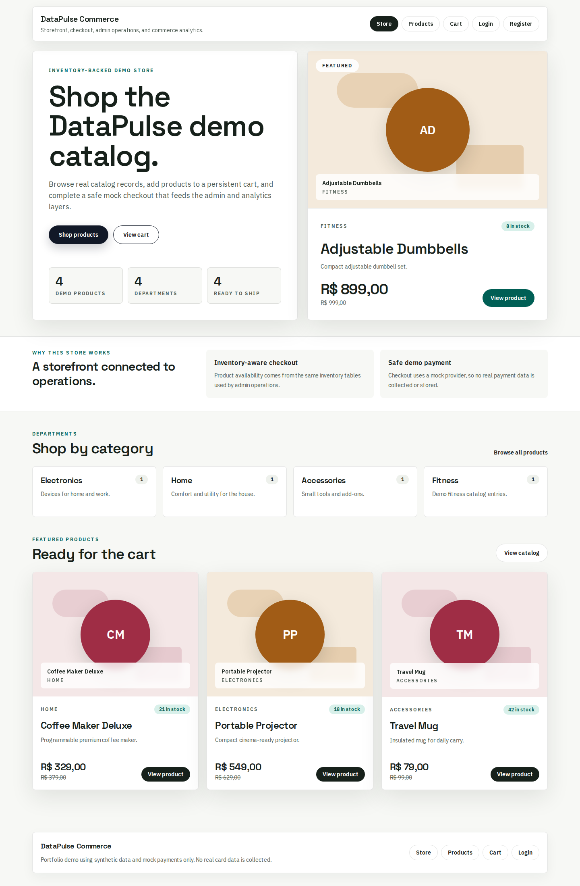
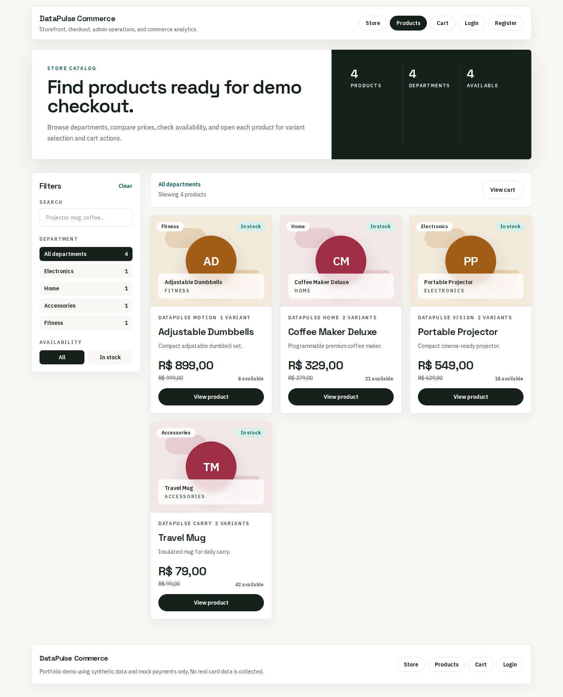
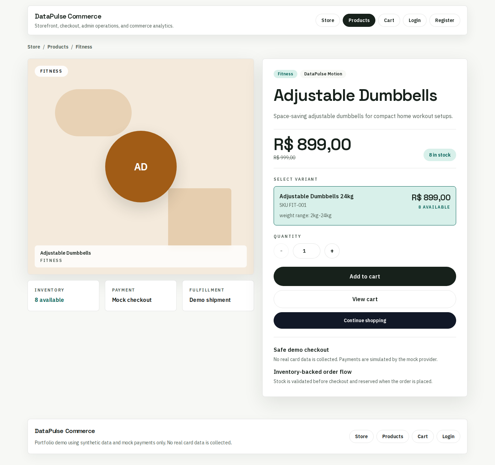
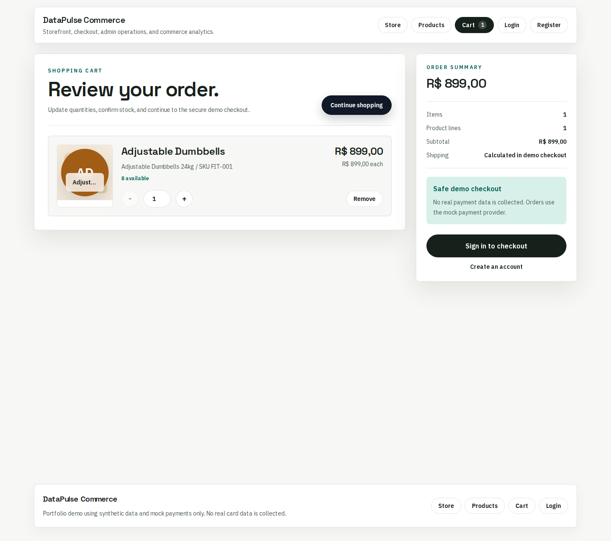
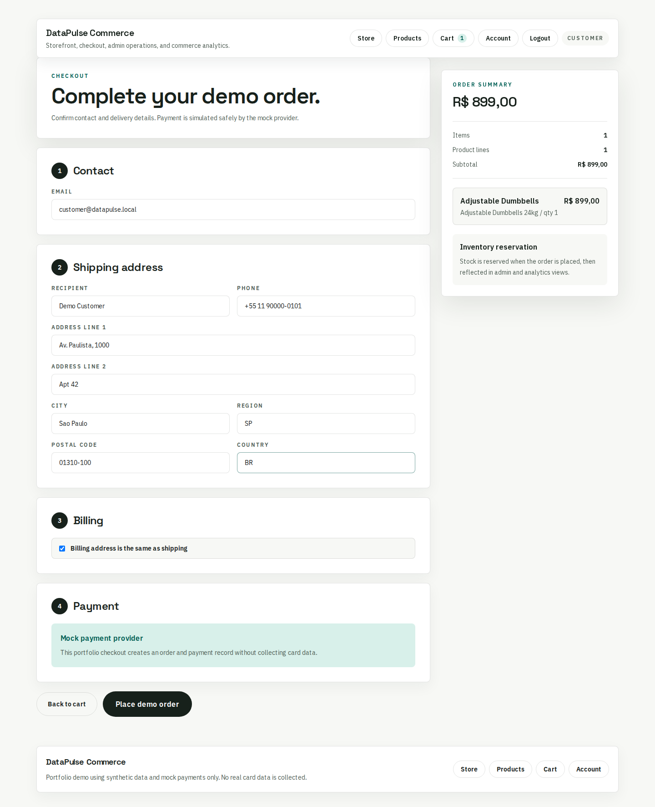
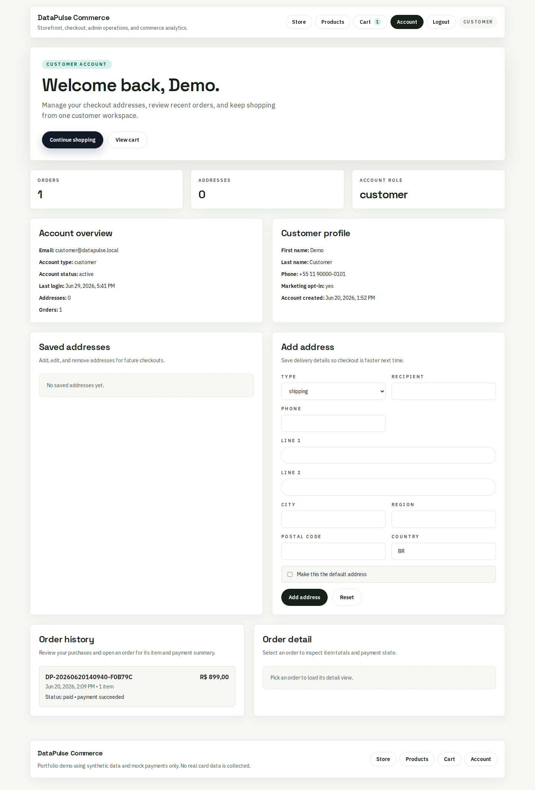
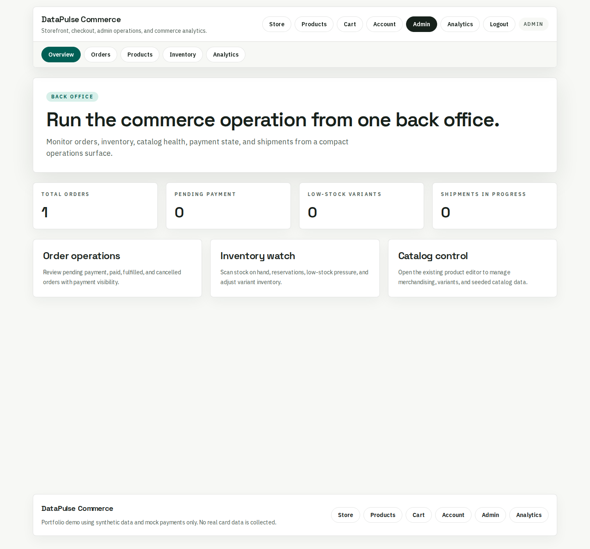
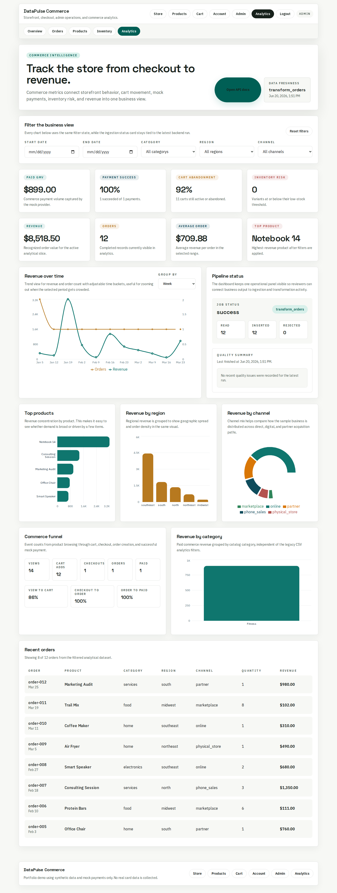

# DataPulse Commerce

Full-stack e-commerce platform with built-in business intelligence.

DataPulse Commerce extends a completed BI project into a transactional commerce system: storefront, catalog, cart, checkout, mock payments, customer accounts, admin operations, inventory, refunds, commerce events, and analytics projection.

## Portfolio Description

Full-stack e-commerce portfolio app with FastAPI, Next.js, PostgreSQL, mock checkout, admin operations, and an analytics dashboard.

## Live Portfolio Demo

- Frontend: https://e-commerce-omega-nine-82.vercel.app
- Backend health: https://ecommerce-8ngt.onrender.com/health
- API docs: https://ecommerce-8ngt.onrender.com/docs

The public demo runs on Vercel, Render, and Supabase using synthetic data and a mock payment provider. Render's free tier may take a short moment to wake the API after inactivity.

## What It Demonstrates

- FastAPI backend with SQLAlchemy, Alembic, PostgreSQL, and service-layer business rules
- Next.js App Router frontend with storefront, checkout, account, admin, and dashboard screens
- Idempotent checkout and mock payment workflow
- Inventory reservation, sale capture, release, adjustment, and low-stock risk
- Admin product, inventory, order, shipment, and refund operations
- Commerce event logging and operational analytics metrics
- Projection from commerce orders into the existing BI dimensional model
- Backend tests, smoke scripts, frontend lint, and production build validation

## Core Demo Flow

```text
storefront -> product detail -> cart -> checkout -> mock payment -> order history
         -> admin order management -> refunds/shipments -> commerce analytics dashboard
```

## Screenshots

| Storefront | Product listing |
| --- | --- |
|  |  |

| Product detail | Cart |
| --- | --- |
|  |  |

| Checkout | Customer account |
| --- | --- |
|  |  |

| Admin back office | Analytics dashboard |
| --- | --- |
|  |  |

## Deployment Architecture

```text
Browser
  -> Vercel Next.js frontend
  -> Render FastAPI backend
  -> Supabase PostgreSQL
```

The backend exposes catalog, cart, checkout, account, admin, and metrics APIs. The frontend consumes those APIs through `NEXT_PUBLIC_API_URL`, while Render CORS is restricted to the deployed Vercel origin.

## Local Quick Start

Start PostgreSQL:

```bash
docker compose up -d
```

Set up backend:

```bash
cd backend
python3 -m venv .venv
source .venv/bin/activate
pip install -r requirements.txt
alembic upgrade head
python scripts/seed_demo_data.py
python scripts/seed_commerce_demo_data.py
python scripts/project_commerce_analytics.py
uvicorn app.main:app --reload
```

Set up frontend:

```bash
cd frontend
npm install
npm run dev
```

Open:

```text
Frontend: http://127.0.0.1:3000
Backend health: http://127.0.0.1:8000/health
API docs: http://127.0.0.1:8000/docs
```

Demo users:

```text
Customer
customer@datapulse.local
customer123-local-only

Admin
admin@datapulse.local
admin123-local-only
```

The login page includes buttons that autofill these demo credentials.

## Validation

Backend:

```bash
cd backend
source .venv/bin/activate
alembic upgrade head
python -m pytest -q
python scripts/run_smoke_checks.py
python scripts/run_commerce_smoke_checks.py
```

Frontend:

```bash
cd frontend
npm run lint
npm run build
```

Production-like Docker configuration check:

```bash
docker compose -f docker-compose.production.yml config
```

Full production-like stack:

```bash
docker compose -p datapulse-commerce-prod -f docker-compose.production.yml up -d --build
docker exec datapulse_backend_prod alembic upgrade head
docker exec datapulse_backend_prod python scripts/seed_demo_data.py
docker exec datapulse_backend_prod python scripts/seed_commerce_demo_data.py
docker exec datapulse_backend_prod python scripts/project_commerce_analytics.py
curl http://127.0.0.1:8000/health
docker compose -p datapulse-commerce-prod -f docker-compose.production.yml down
```

## Important Endpoints

- `GET /health`
- `GET /catalog/products`
- `POST /cart/items`
- `POST /checkout/sessions`
- `POST /checkout/orders`
- `POST /payments/orders/{order_id}`
- `POST /payments/{payment_id}/simulate-success`
- `GET /account/orders`
- `GET /admin/overview`
- `POST /admin/orders/{order_id}/refunds`
- `GET /metrics/conversion-funnel`
- `GET /metrics/payment-health`
- `GET /metrics/inventory-risk`

## Documentation

- [Current state](docs/actual_state.md)
- [Development plan](docs/development_plan.md)
- [Architecture](docs/architecture.md)
- [Database modeling](docs/database_modeling.md)
- [Deployment](docs/deployment.md)
- [Testing](docs/testing.md)

## Demo Safety

- Payments use a mock provider only.
- Demo data is synthetic.
- No card data is collected or stored.
- Demo credentials are for portfolio demonstration only.
- Public deployment should use dedicated synthetic seed data and non-sensitive credentials.

## Known Limitations

- Payments are mocked; no real payment provider adapter is enabled yet.
- Product data is synthetic.
- Refunds are represented as successful mock refund records.
- Seeded products use styled fallback visuals; production product media would
  need real uploaded assets or hosted image storage.
- No real email, shipping-rate, tax, or promotion engines are implemented yet.
- Concurrency hardening is covered by transactional design but not load-tested.
- Render free-tier hosting may cold start after inactivity.

## Roadmap

- Add optional sandbox payment adapter
- Add coupon/promotion support
- Add browser E2E tests for checkout and admin workflows
- Add richer commerce analytics such as cohort and funnel timelines
